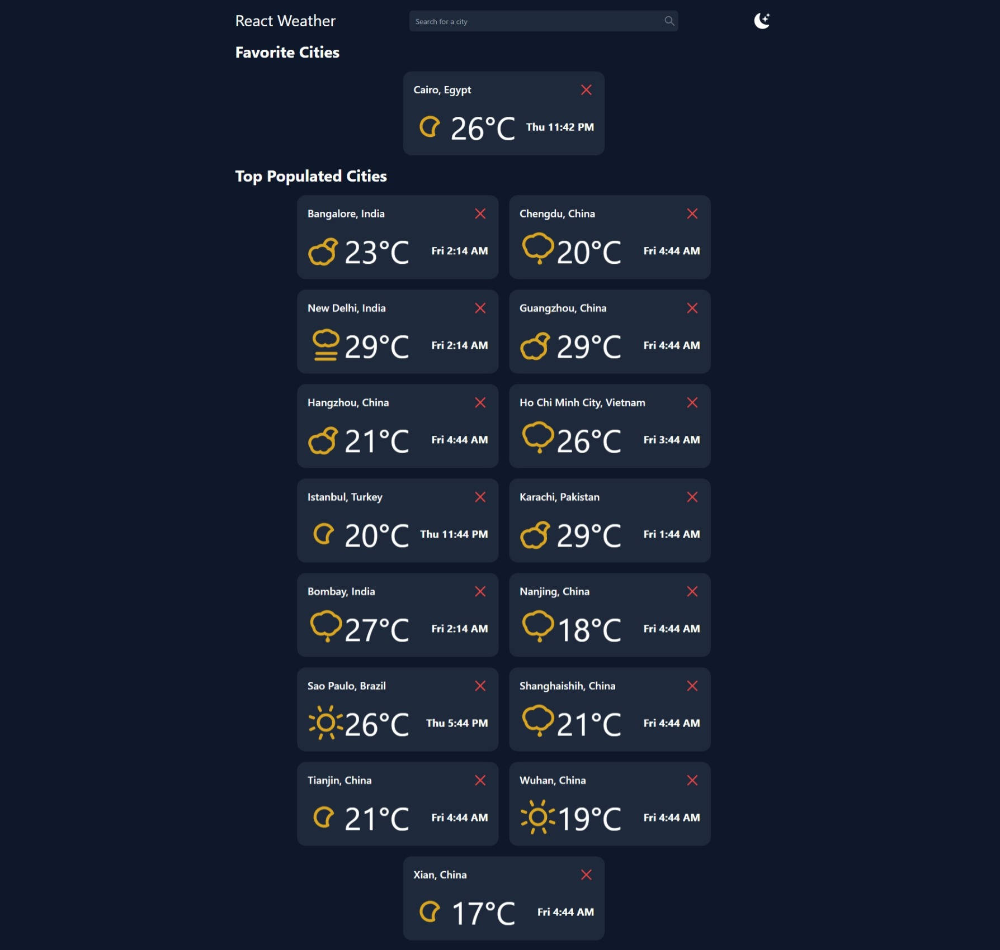
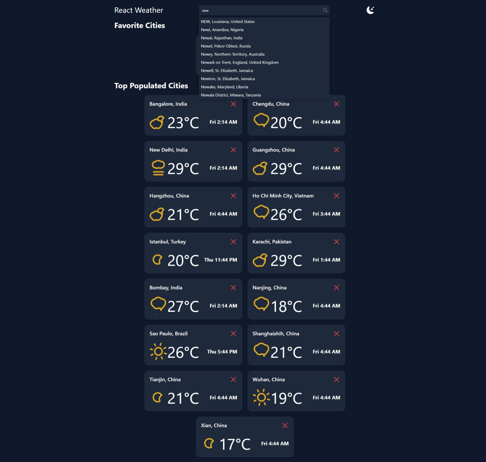
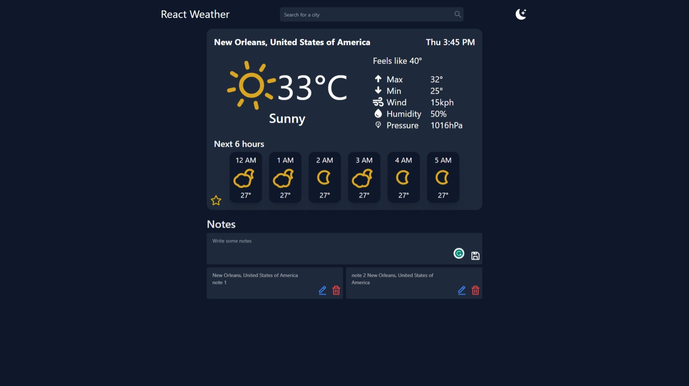
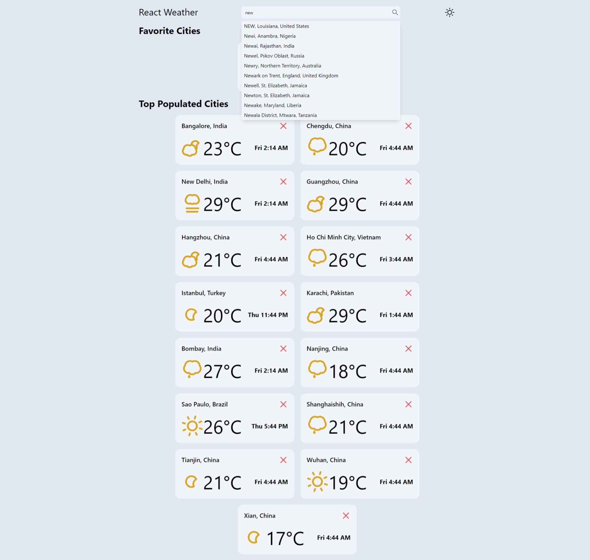
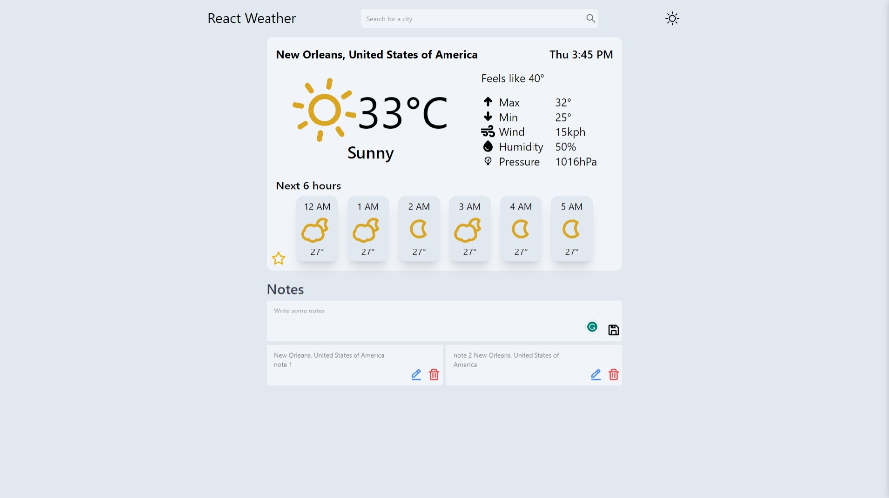

# Assignment Version Number: FE-2023-04-ii

## API Choices

So, for this assignment, I had to fetch data about the top 15 largest cities in the world by population. I had a choice here: I could have simply used a static array of these top 15 cities, but I decided to take a more dynamic approach and went with using an API to obtain this data. The API I used for this purpose can be found at the following URL: [http://api.geonames.org/](http://api.geonames.org/).

One of the main reasons I opted for this API was its handy auto-complete feature, which I believed would greatly enhance the user experience.

Now, when it came to fetching weather data, I chose to work with the weatherapi.com API. This API offered a couple of appealing features, including providing free forecast data for 3 days and allowing 1 million requests per month. In comparison, another option I considered, the weatherstack API, only allowed 1000 requests per month, which I found insufficient for testing purposes.

## Libraries

In terms of libraries, here's what I used:

- To make API calls, I relied on **axios**. It's a dependable choice, handling errors gracefully and boasting user-friendly usage.

- For data caching to enable offline functionality, I turned to **tanstack react-query**. This library is a breeze to work with, offering features such as caching, refetching, and pagination. It's smart enough to use cached results when available and automatically refetches data when the user is online, refreshing the cache every 5 minutes.

- For styling, I went with **tailwindcss**. This library is an absolute gem, known for its ease of use and packed with useful features like dark mode and responsive design, didn't use any components library.

- When it came to icons, I used **react-icons**, which offers an extensive collection of icons.

## Testing

To ensure the reliability of the application, I employed **jest** and wrote unit tests for the most components.

## Features

- **Auto-complete**: The search bar offers auto-complete functionality, which makes it easier for the user to find the city they're looking for.
- **Dark Mode**: The application offers a dark mode, which can be toggled by clicking on the moon icon in the top right corner.
- **Offline Functionality**: The application offers offline functionality, which means that the user can still access the weather data for the last city they searched for even when they're offline.
- **Notes**: The user can add notes to the weather details page, which are saved in the local storage and can be accessed even when the user is offline.

## Folder Structure

- **components**: This folder contains all the components used in the application, it contains a common folder which contains all the components that are used a-lot i wrote those components to be reusable and easily portable to any other project.

- **hooks**: This folder contains all the custom hooks used in the application, which i built from scratch, they can be used in any other project.
- **pages**: This folder contains all the pages used in the application and it uses components from the components folder each page has its own folder,in each folder there is a file called index.js which is the main file of the page and a file called after the page name which contains all the logic of the page such as fetching data and mapping it to the components.

- **utils**: This folder contains all the utility functions used in the application.

- **services**: This folder contains all the services used in the application, the api calls are made in this folder.

## How to Run the Project

To get this project up and running, follow these simple steps:

1. Clone the project to your local environment.
2. Run `npm install` to install all the necessary dependencies.
3. Execute `npm start` to launch the project.
4. For running tests, use `npm test`.

Alternatively, you can also access the deployed version of the project on Netlify by clicking [here](https://weather-app-pi-olive.vercel.app/).

## Screenshots

### Dark Mode

- **Home Page**
  

- **Search Results**
  

- **Weather Details and Notes**
  

### Light Mode

- **Home Page**
  

- **Weather Details and Notes**
  
